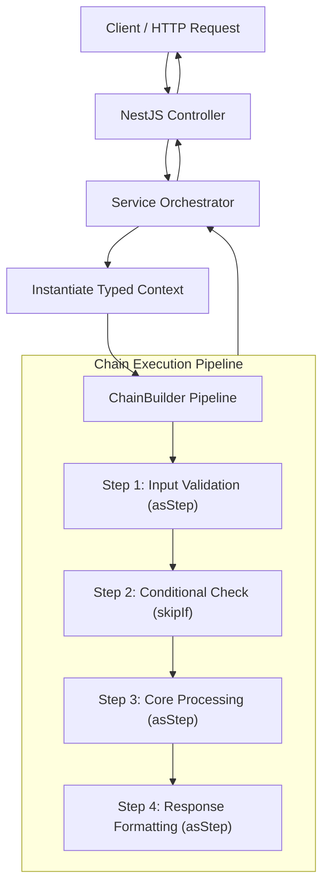

# Architecture, Framework & TypeScript ESLint Rules for `nestjs-pipeline-service`

Derived from the enterprise codebase of `lift-be-initial-booking`, this document establishes the mandatory design patterns, strict TypeScript standards, ESLint configuration rules, and framework architecture for building **`nestjs-pipeline-service`**.

---

## 🎯 Repository Scope & Objective

**`nestjs-pipeline-service`** is a **standalone, domain-agnostic NestJS Pipeline Framework & Template**.

- **No Domain Constraints**: It does NOT include any specific business domain logic (such as airline booking, hotel reservations, or e-commerce orders).
- **In-House Infrastructure**: All core abstractions, pattern wrappers, error factory modules, and logging utilities previously imported from external libraries (`lift-be-common`) are built **directly inside this repository** (under `src/core/` and `src/shared/`).
- **Starter Blueprint**: It provides a clean, fully functional sample feature pipeline (`src/modules/sample-pipeline/`) demonstrating the Chain of Responsibility pattern.

---

## 📑 Table of Contents

1. [High-Level Framework Architecture](#1-high-level-framework-architecture)
2. [Strict TypeScript & ESLint Coding Rules](#2-strict-typescript--eslint-coding-rules)
3. [Core Pattern Implementations (`ChainBuilder` & Step Wrappers)](#3-core-pattern-implementations-chainbuilder--step-wrappers)
4. [Directory & Modular Layout](#4-directory--modular-layout)
5. [Controller & Service Layer Standards](#5-controller--service-layer-standards)
6. [Error Handling & Resiliency Framework](#6-error-handling--resiliency-framework)
7. [Logging & Observability Framework](#7-logging--observability-framework)
8. [DTOs & Request Validation](#8-dtos--request-validation)
9. [Unit Testing Guidelines](#9-unit-testing-guidelines)

---

## 1. High-Level Framework Architecture

The framework relies on **Clean Architecture**, **Strict TypeScript**, and the **Chain of Responsibility Pattern**:



---

## 2. Strict TypeScript & ESLint Coding Rules

`nestjs-pipeline-service` strictly enforces `typescript-eslint/strictTypeChecked` and custom formatting rules derived from `eslint.config.mjs`.

### A. Type Annotations & Explicit Typing Rules
1. **Explicit Function Return Types (`@typescript-eslint/explicit-function-return-type`)**:
   - **MANDATORY**: All function declarations, arrow functions, class methods, and step handlers MUST have explicit return types.
   ```typescript
   // ❌ BAD - Inferred return type
   export function calculateTotal(items: Item[]) {
     return items.reduce((sum, item) => sum + item.price, 0);
   }

   // ✅ GOOD - Explicit return type
   export function calculateTotal(items: Item[]): number {
     return items.reduce((sum, item: Item): number => sum + item.price, 0);
   }
   ```
2. **Explicit Variable Types**:
   - Explicitly annotate complex variables, function arguments, context properties, and array primitives (`Item[]` or `Array<Item>`).
3. **No Unsafe `any` (`@typescript-eslint/no-explicit-any`)**:
   - `any` is strictly prohibited. Use `unknown`, generic parameters, or explicit interfaces/type aliases.
4. **No Unsafe Assignment/Call/Member Access**:
   - Rules `@typescript-eslint/no-unsafe-assignment`, `@typescript-eslint/no-unsafe-call`, `@typescript-eslint/no-unsafe-member-access`, and `@typescript-eslint/no-unsafe-argument` are enabled as **errors**.
5. **Separate Type Imports (`@typescript-eslint/consistent-type-imports`)**:
   - Pure type or interface imports MUST use `import type { ... }`:
   ```typescript
   // ❌ BAD
   import { User, Role } from './user.interface';

   // ✅ GOOD
   import type { Role, User } from './user.interface';
   ```

### B. Import Ordering Rules (`simple-import-sort`)
Imports MUST be sorted automatically in alphabetical order with grouping:
1. External packages (`@nestjs/common`, `rxjs`)
2. Internal absolute imports (`src/core/...`, `src/shared/...`)
3. Relative imports (`./context`, `../steps`)

```typescript
import { Controller, Get } from '@nestjs/common';
import type { AppLoggerService } from 'src/core/logging/app-logger.service';

import type { ISampleContext } from './context';
import { sampleStep } from './steps';
```

### C. Equality & Formatting
- **Strict Equality (`eqeqeq`)**: Use `===` and `!==` (smart rule enabled).
- **Nullish Coalescing & Optional Chaining**: Prefer `??` over `||` (`@typescript-eslint/prefer-nullish-coalescing`) and `?.` (`@typescript-eslint/prefer-optional-chain`).
- **Single Quotes & Trailing Commas**: Single quotes (`'`), trailing commas (`"trailingComma": "all"`).

---

## 3. Core Pattern Implementations (`ChainBuilder` & Step Wrappers)

Since `lift-be-common` is not used, the framework implements these core pattern utilities inside `src/core/patterns/`:

### A. `ChainBuilder<TContext>`
```typescript
// src/core/patterns/chain-builder.ts
export type StepHandler<TContext> = (
  context: TContext,
) => Promise<TContext> | TContext;

export class ChainBuilder<TContext> {
  private readonly steps: Array<StepHandler<TContext>> = [];

  public add(step: StepHandler<TContext>): this {
    this.steps.push(step);
    return this;
  }

  public build(): { handle: (initialContext: TContext) => Promise<TContext> } {
    return {
      handle: async (initialContext: TContext): Promise<TContext> => {
        let currentContext = initialContext;
        for (const step of this.steps) {
          currentContext = await step(currentContext);
        }
        return currentContext;
      },
    };
  }
}
```

### B. `asStep`, `skipIf`, `skipUnless` Wrappers (`src/shared/utils/chain-step-logger.ts`)
Each step MUST be wrapped with logging decorators to track performance and trace execution:

```typescript
// src/shared/utils/chain-step-logger.ts
export function asStep<TContext>(
  handler: StepHandler<TContext>,
): StepHandler<TContext> {
  return wrapWithStepLogging(handler.name, handler);
}

export function skipIf<TContext>(
  predicate: (context: TContext) => boolean,
  handler: StepHandler<TContext>,
): StepHandler<TContext> {
  const wrapped = wrapWithStepLogging(handler.name, handler);
  return async (context: TContext): Promise<TContext> => {
    if (predicate(context)) {
      return context;
    }
    return wrapped(context);
  };
}

function wrapWithStepLogging<TContext>(
  fallbackName: string,
  handler: StepHandler<TContext>,
): StepHandler<TContext> {
  const stepName: string = fallbackName || 'anonymousStep';

  return async (context: TContext): Promise<TContext> => {
    const logger = (context as { appLogger?: AppLoggerService }).appLogger;

    logger?.info(`Starting ${stepName}`, {
      event: 'THIRD_PARTY_CALL_STARTED',
      operation: stepName,
    });

    try {
      const result: TContext = await handler(context);
      logger?.info(`Completed ${stepName}`, {
        event: 'THIRD_PARTY_CALL_COMPLETED',
        operation: stepName,
      });
      return result;
    } catch (error: unknown) {
      logger?.error(`${stepName} failed`, {
        event: 'UNHANDLED_EXCEPTION',
        operation: stepName,
      });
      throw error;
    }
  };
}
```

> **NAMED FUNCTION RULE**: Step handlers MUST use named function syntax (`function validateStep(context: TContext): TContext`) so `handler.name` accurately reflects the operation name in logs.

---

## 4. Directory & Modular Layout

```text
nestjs-pipeline-service/
├── src/
│   ├── main.ts                        # Global setup (ValidationPipe, Helmet, Swagger, Prefix)
│   ├── app.module.ts                  # Main Root Module (Registers Logger, Global Filter, Interceptors)
│   ├── app.controller.ts              # Health & status endpoint
│   ├── core/                          # Framework Core Engine (Replaces lift-be-common)
│   │   ├── errors/                    # ErrorFactoryService & AppExceptionFilter
│   │   ├── logging/                   # AppLoggerService & AppLoggerInterceptor
│   │   ├── middleware/                # TraceabilityMiddleware
│   │   └── patterns/                  # ChainBuilder & Step types
│   ├── modules/                       # Feature Modules
│   │   └── sample-pipeline/           # Sample Framework Demonstration Module
│   │       ├── chains/
│   │       │   └── process-sample-chain/
│   │       │       ├── chain.ts       # Chain composition
│   │       │       ├── context.ts     # Typed context interface
│   │       │       └── steps/         # Atomic step handlers
│   │       │           ├── validate-payload.step.ts
│   │       │           ├── process-data.step.ts
│   │       │           └── index.ts
│   │       ├── dto/                   # DTO definitions
│   │       ├── sample-pipeline.controller.ts
│   │       ├── sample-pipeline.module.ts
│   │       └── sample-pipeline.service.ts
│   └── shared/                        # Shared Helpers, Constants, Guards
│       ├── constants/
│       ├── guards/                    # Session / Auth Guards
│       └── utils/
│           └── chain-step-logger.ts   # Step Logging Wrappers
├── eslint.config.mjs                  # Strict TypeScript ESLint setup
├── prettier.config.js                 # Prettier formatting config
├── tsconfig.json                      # Strict Node16/ES2022 TypeScript configuration
└── package.json
```

---

## 5. Controller & Service Layer Standards

### Controller Rules
- Route handlers MUST delegate immediately to the Service layer. No business logic in controllers.
- Use explicit OpenAPI Swagger decorators (`@ApiOperation`, `@ApiResponse`, `@ApiTags`).

```typescript
@ApiTags('sample-pipeline')
@Controller('sample-pipeline')
export class SamplePipelineController {
  constructor(private readonly service: SamplePipelineService) {}

  @Post('process')
  @HttpCode(HttpStatus.OK)
  @ApiOperation({ summary: 'Process payload through pipeline' })
  @ApiResponse({ status: HttpStatus.OK, type: SampleResponseDto })
  async process(
    @Body() dto: SampleRequestDto,
  ): Promise<SampleResponseDto> {
    return this.service.executePipeline(dto);
  }
}
```

---

## 6. Error Handling & Resiliency Framework

- Custom errors use `ErrorFactoryService`:
  ```typescript
  throw context.errorFactoryService
    .createError('BUSINESS_RULE_VIOLATION')
    .withRawErrorMessage('Invalid condition detected');
  ```
- Caught at the HTTP boundary by `AppExceptionFilter` to produce standardized JSON output:
  ```json
  {
    "statusCode": 400,
    "errorCode": "BUSINESS_RULE_VIOLATION",
    "message": "Invalid condition detected",
    "timestamp": "2026-07-24T14:20:00.000Z"
  }
  ```

---

## 7. Logging & Observability Framework

- `AppLoggerService` provides structured JSON logging with context events.
- All step functions log entrance, completion, and unhandled exceptions automatically.

---

## 8. DTOs & Request Validation

- All request DTO fields MUST have explicit `class-validator` and `@ApiProperty` annotations:
  ```typescript
  export class SampleRequestDto {
    @ApiProperty({ description: 'Payload title identifier' })
    @IsString()
    @IsNotEmpty()
    title: string;
  }
  ```

---

## 9. Unit Testing Guidelines

- All services, controllers, and pipeline steps MUST have co-located `*.spec.ts` unit tests.
- Step unit tests pass mock `IContext` objects and assert context state transformations or error throws.

---
