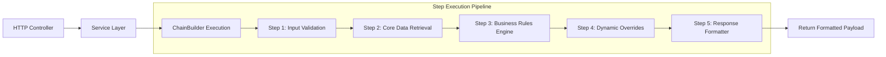

# NestJS Pipeline Microservice Template

A production-ready NestJS microservice starter designed for complex business workflows. This architecture leverages the **Chain of Responsibility** pattern, **Typed Context Objects**, and **Functional Step Handlers** to keep business logic clean, testable, and modular.

---

## 🏛️ Key Architectural Features

- **Chain of Responsibility Pattern**: Complex workflows are decomposed into discrete, single-responsibility step handlers composed via a pipeline builder (`ChainBuilder`).
- **Context Object Pattern**: Request lifecycle state is maintained within a strongly-typed execution context passed sequentially through the pipeline steps.
- **Functional Step Factories**: Pipeline steps are structured as reusable step handlers equipped with execution wrappers for structured logging, performance metrics, and conditional execution (`skipIf` / `skipUnless`).
- **Domain Integration Layer**: Third-party APIs, caching, and business rule engines are isolated behind domain service adapters.
- **Observability & Resiliency**: Built-in structured context logging, correlation IDs, centralized error factory services, and Redis/In-memory caching.

---

## 🔄 Workflow Execution Pipeline

Below is a conceptual illustration of how requests pass through the chain:



---

## 📁 Directory Structure

```text
src/
├── config/                  # Environment and application configuration
├── domain/                  # External integrations (APIs, DB, Caching adapters)
├── modules/                 # Modular feature domains
│   └── <feature>/
│       ├── chains/          # Workflow chains
│       │   ├── <name>-chain/# Pipeline definition, context, & steps
│       │   └── shared/      # Reusable step factories across chains
│       ├── dto/             # Data Transfer Objects
│       ├── *.controller.ts  # HTTP Request Handlers
│       ├── *.module.ts      # Feature Module Definition
│       └── *.service.ts     # Service Orchestrator
└── shared/                  # Utilities, Error Factories, Logger Contexts, Guards
```

---

## 🛠️ Step Creation Example

### 1. Defining a Step Handler

```typescript
import { asStep } from 'src/shared/utils/chain-step-logger';
import type { FeatureContext } from '../context';

export function createValidationStep<T extends FeatureContext>() {
  return asStep<T>(async (context: T) => {
    if (!context.requestParams) {
      throw context.errorFactory.createError('MISSING_PARAMETERS');
    }
    // Perform step logic & enrich context
    context.isValidated = true;
    return context;
  });
}
```

### 2. Composing the Chain

```typescript
import { ChainBuilder } from 'src/shared/patterns/chain-builder';
import type { FeatureContext } from './context';
import {
  createValidationStep,
  createFetchDataStep,
  createFormatResponseStep,
} from './steps';

export const featureChain = new ChainBuilder<FeatureContext>()
  .add(createValidationStep())
  .add(createFetchDataStep())
  .add(createFormatResponseStep())
  .build();
```

---

## 🚀 Getting Started

### Prerequisites

- Node.js (v18+)
- pnpm / npm / yarn

### Installation

```bash
# Clone the repository
git clone https://github.com/YOUR_USERNAME/YOUR_REPO_NAME.git

# Install dependencies
pnpm install

# Start development server
pnpm start:dev
```

---

## 🧪 Testing

```bash
# Unit tests
pnpm test

# Test coverage
pnpm test:cov
```

---

## 📜 License

This project is licensed under no license.
